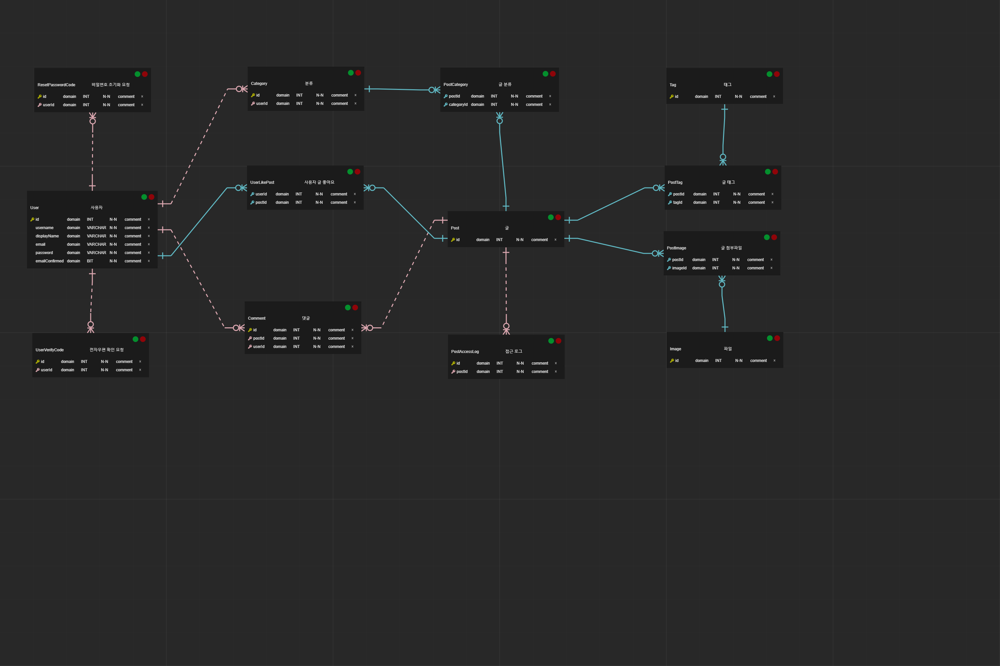

# Blog Backend

[NodeBlog](https://github.com/bbonkr/nodeblog) 저장소에서 백엔드와 프론트엔드를 분리합니다.

TypeScript로 작성하며, Nodejs 로 실행합니다.

## Stack

-   [Nodejs](https://nodejs.org)
-   [TypeScript](https://www.typescriptlang.org/)
-   [Express](https://expressjs.com/ko/)
-   [Passport](http://www.passportjs.org/)
-   [Sequelize](https://sequelize.org/)
-   [MariaDB](https://mariadb.org/)

## Features

Express 기반의 웹 응용프로그램을 구현합니다.

Passport 로 인증을 구현하고, JWT 를 사용합니다.

Sequelize 로 ORM을 사용하고, 대상 데이터베이스는 MariaDB를 사용합니다.

## ERD



> 다이어그램은 [vuerd-front](https://github.com/vuerd/vuerd-front) 로 작성되었습니다.

## Docker

도커 이미지를 빌드합니다.

```bash
$ docker build --tag bbonkr/blog-service-backend:1.0.0 .
```

latest 태그 참조를 변경합니다.

```
$ docker tag bbonkr/blog-service-backend:1.0.0 bbonkr/blog-service-backend:latest
```

환경 변수

> .env.sample 파일 참조

-   SITE_NAME
-   COOKIE_SECRET
-   JWT_SECRET
-   JWT_ISSUER
-   JWT_AUDIENCE
-   DB_HOST
-   DB_PORT
-   DB_DATABASE
-   DB_USERNAME
-   DB_PASSWORD

docker-compose 를 사용하려면 아래 내용을 참조해서 `docker-compose.yml` 파일을 작성합니다.

```yaml
version: '3'

services:
    blog-service-api:
        container_name: blog-service-api
        image: bbonkr/blog-service-backend:latest
        external_links:
            - db:db
        environment:
            - SITE_NAME=nodeblog
            - COOKIE_SECRET=nodeblog
            - JWT_SECRET=nodeblog
            - JWT_ISSUER=localhost
            - JWT_AUDIENCE="http://localhost:3000"
            - DB_HOST=db
            - DB_PORT=3306
            - DB_DATABASE=nodeblog
            - DB_USERNAME=nodeblog
            - DB_PASSWORD=nodeblog
            - SKIP_PREFLIGHT_CHECK=true
        ports:
            - '5000:5000'
        volumes:
            - /my-local-dir/uploads:/usr/src/app/uploads
        network_mode: bridge
```

작성 후 아래 명령으로 컨테이너를 실행합니다.

```bash
$ docker-compose up -d --force-recreate
```
